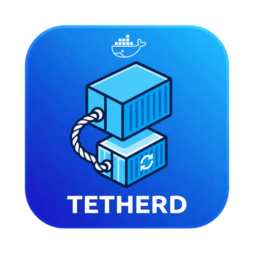

# Tetherd

Keeps containers attached to the network of the container they route through.

If you run apps through a VPN sidecar with `--network container:gluetun`, those
apps lose their networking whenever the VPN container restarts or is recreated.
Tetherd watches for that and repairs it — preferring a plain restart, and only
rebuilding a container when it genuinely has to.

> Status: early development. Not yet released.

## Why another one of these

Tetherd is a clean-room successor to
[Rebuild-DNDC](https://github.com/elmerfds/rebuild-dndc), which is no longer
actively maintained. It is not a fork and shares no code. It exists to fix two
design problems that caused most of the bugs in the original:

**It reads container config from Docker, not from Unraid XML templates.** The
original rebuilt containers by locating an Unraid template file, guessing its
name from the container name, and re-parsing the XML. That picked the wrong
template for similarly named containers, silently dropped volumes and ports
whenever Unraid changed its template format, and tied the whole tool to Unraid.
Tetherd snapshots each managed container's actual configuration from the Docker
API, so a rebuild reproduces exactly what was there — labels, mounts, resource
limits and all — and works on any Docker host.

**It repairs without destroying wherever possible.** The original always did
`stop`, `rm`, then recreate. When the recreate failed, your container was gone.
Tetherd distinguishes the two ways networking breaks:

- The provider was **restarted**, so its network namespace was replaced. The
  dependent still looks healthy by every obvious measure but has no network. A
  plain `docker restart` fixes it completely. This case is undetectable by
  comparing container IDs, which is why the original never handled it.
- The provider was **recreated**, so it has a new container ID and the dependent
  cannot start at all. Only here is a rebuild necessary — and Tetherd validates
  the replacement configuration *before* touching the existing container, then
  renames it aside rather than deleting it, so a failure is recoverable.

Deliberately stopped containers also stay stopped.

## Running it

The image talks to the host Docker socket. It runs as root for the same reason
Watchtower does: that socket is typically `root:docker` mode `660`, and Unraid
will not set `--group-add` for you.

```bash
docker run -d \
  --name tetherd \
  --restart unless-stopped \
  -e TZ=Europe/London \
  -e TETHERD_PROVIDER=gluetun \
  -v /var/run/docker.sock:/var/run/docker.sock \
  -v /path/to/appdata/tetherd:/config \
  philbarker79/tetherd
```

Published images live on Docker Hub as `philbarker79/tetherd` and on GHCR as
`ghcr.io/phil-barker/tetherd`. `tetherd:local` is the tag this repo's
Dockerfile builds for development.

On Unraid, also mount the notifier and the user templates if you want native
notifications and a template audit from `tetherd doctor`:

```
-v /usr/local/emhttp:/usr/local/emhttp:ro
-v /boot/config/plugins/dockerMan/templates-user:/config/docker-templates:ro
```

`compose.yaml` in this repo is the same thing, for a generic Docker host.

Coming from Rebuild-DNDC, stop that container first, then
`tetherd import-rdndc --env-file old.env`. Details in
[docs/migration.md](docs/migration.md).

Useful commands, from another shell against a running container:

```bash
docker exec tetherd tetherd status
docker exec tetherd tetherd doctor
docker exec tetherd tetherd rebuild qbittorrent --dry-run
```

More in [docs/quick-start.md](docs/quick-start.md).

## Documentation

- [Quick start](docs/quick-start.md)
- [Network wiring](docs/network-wiring.md) — `container:` vs Extra Params, ports, two providers
- [Configuration](docs/configuration.md)
- [Migrating from Rebuild-DNDC](docs/migration.md)
- [Troubleshooting](docs/troubleshooting.md)
- [Unraid](docs/unraid.md) — why this is still needed on 7.x, labels, templates
- [Publishing](docs/publishing.md) — Docker Hub, GHCR, Community Applications
- [Design notes](docs/design-notes.md) — empirical Docker and Unraid findings the code depends on

## Requirements

- Docker Engine 20.10 or newer
- Access to the Docker socket
- Works on Unraid, plain Docker, and Compose-managed containers

## Development

```bash
uv sync
uv run pytest -m 'not integration'    # unit tests
uv run pytest -m integration          # needs a live daemon
uv run ruff check .
uv run mypy
docker build -t tetherd:local .
```

`scripts/spike-netns.sh` verifies the Docker behaviours the design relies on
against your local daemon. The findings are written up in
[docs/design-notes.md](docs/design-notes.md).

## Transparency

I'm Phil Barker. I've been a software engineer for thirty years. This
repository is co-developed with [Cursor](https://cursor.com), an AI coding
assistant.

I'm putting that in the README because a lot of people in open source and
homelab are, reasonably, tired of unreviewed generated code landing on GitHub.
I designed the behaviour this tool has to have, I review every change, and the
tests encode failure modes that were found the hard way on real Unraid boxes —
including mine. Cursor is a faster pair-programmer. It is not an unsupervised
author, and it does not get a commit I have not read.

If that still makes this the wrong project for you, that is a fair call. I'd
rather you knew how it was made than find out from a git blame later.

## Credits

Inspired by [Rebuild-DNDC](https://github.com/elmerfds/rebuild-dndc) by
elmerfds, and by the users who documented its failure modes in that project's
issue tracker over the years.

## License

MIT
